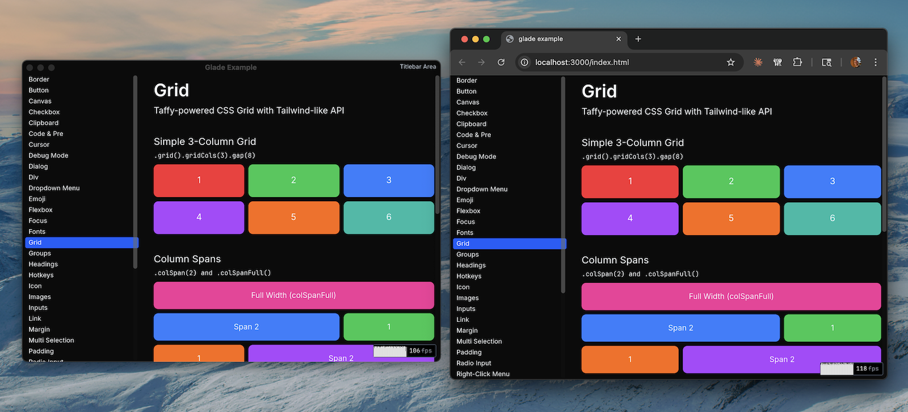
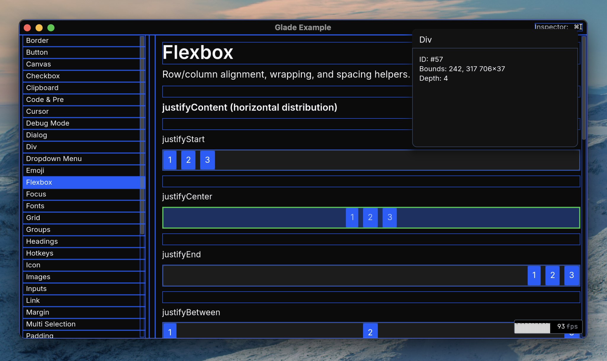

# Glade

***Glade is a cross-platform GUI library for Typescript that uses WebGPU to render apps at 120fps, for browsers and native macOS.***

https://glade.graphics

Glade is a library for writing cross-platform graphical applications with TypeScript and JavaScript. It uses WebGPU and includes an application framework and component library (text, inputs, flexbox layouts, etc.), all drawn using WebGPU. For browsers, it renders to a canvas element. For native macOS, it renders to a GLFW window via Google's Dawn WebGPU implementation. Glade is a backronym for GL-assisted Drawing environment, which seemed like a fun name when this project started, because it originally used WebGL/OpenGL. It now uses WebGPU, but the name stuck.

https://glade.graphics

---

# Development + Contributing

Bootstrap your local environment by installing the tools we use. Run `./scripts/bootstrap.macos.sh` Then install dependencies by running `./scripts/install.sh`.

Run `turbo run --filter='*' build.release` to build _everything_ (including the layout, shaper, and svg Rust crates as WASM modules.) Then you should be good to run the demo by running `bun run run:demos:macos`. I don't have hot-reloading or file-watchers setup, so my development flow has been to make a change, re-run the demo.

Hitting `⌘ I` will turn on the "debug mode" inspector that outlines things, which is useful for debugging layout and viewport issues.

New features, bug fixes, and other improvements are always welcome. If you need a PR reviewed, please send me an email, and I'll try to take a look when I've got a moment.

---

# License

MIT License

Copyright (c) 2026 Ben Vogt

Permission is hereby granted, free of charge, to any person obtaining a copy
of this software and associated documentation files (the "Software"), to deal
in the Software without restriction, including without limitation the rights
to use, copy, modify, merge, publish, distribute, sublicense, and/or sell
copies of the Software, and to permit persons to whom the Software is
furnished to do so, subject to the following conditions:

The above copyright notice and this permission notice shall be included in all
copies or substantial portions of the Software.

THE SOFTWARE IS PROVIDED "AS IS", WITHOUT WARRANTY OF ANY KIND, EXPRESS OR
IMPLIED, INCLUDING BUT NOT LIMITED TO THE WARRANTIES OF MERCHANTABILITY,
FITNESS FOR A PARTICULAR PURPOSE AND NONINFRINGEMENT. IN NO EVENT SHALL THE
AUTHORS OR COPYRIGHT HOLDERS BE LIABLE FOR ANY CLAIM, DAMAGES OR OTHER
LIABILITY, WHETHER IN AN ACTION OF CONTRACT, TORT OR OTHERWISE, ARISING FROM,
OUT OF OR IN CONNECTION WITH THE SOFTWARE OR THE USE OR OTHER DEALINGS IN THE
SOFTWARE.
