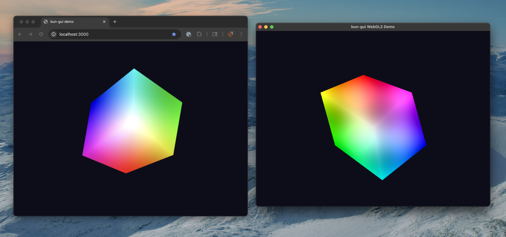

# glade

> GL-assisted Drawing Environment

Glade is a library for writing graphical applications with WebGPU in Javascript that can run in the browser, or natively on Darwin (macOS) via Dawn. The idea is that you can use the normal, browser-friendly [WebGPU interfaces](https://developer.mozilla.org/en-US/docs/Web/API/WebGPU_API) to draw to a context, whether that context is in a canvas HTML element, or in a GLFW native window.

